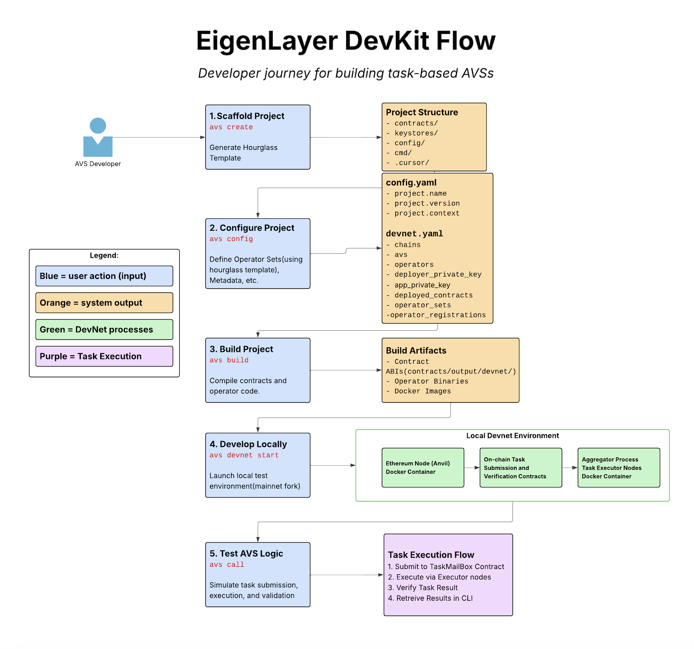

## ⚠️ Disclaimer: Closed Alpha Not Production Ready
EigenLayer DevKit is currently in a closed alpha stage and is intended strictly for local experimentation and development. It has not been audited, and should not be used for use in any live environment, including public testnets or mainnet. Users are strongly discouraged from pushing generated projects to remote repositories without reviewing and sanitizing sensitive configuration files (e.g. devnet.yaml), which may contain private keys or other sensitive material.

# EigenLayer Development Kit (DevKit) 🚀

**A CLI toolkit for scaffolding, developing, and testing EigenLayer Autonomous Verifiable Services (AVS).**

EigenLayer DevKit streamlines AVS development, enabling you to:
* Quickly scaffold projects
* Compile contracts
* Run local networks
* Simulate tasks.

Use DevKit to get from AVS idea to Proof of Concept with a local testing environment that includes task simulation.

> **Note:** The current DevKit features support local experimentation, development, and testing of AVS using the Hourglass task-based framework. We're actively expanding capabilities, so if there's a gap for your scenario, check out our roadmap see what's coming, or let us know what would support you in building AVS.



## 🌟 Key Commands Overview

| Command        | Description                                                       |
|----------------|-------------------------------------------------------------------|
| `devkit avs create`   | Scaffold a new AVS project                                        |
| `devkit avs config`   | Configure your Project (`config/config.yaml`) |
| `devkit avs context`   | Configure your environment and AVS (`config/devnet.yaml`...) |
| `devkit avs build`    | Compile AVS smart contracts and binaries                          |
| `devkit avs devnet`   | Manage local development network                                  |
| `devkit avs call`     | Simulate AVS task execution locally                               |


---

## 🚦 Getting Started

### ✅ Prerequisites

Before you begin, ensure you have:

* [Docker](https://docs.docker.com/engine/install/)
* [Go](https://go.dev/doc/install)
* [make](https://formulae.brew.sh/formula/make)
* [Foundry](https://book.getfoundry.sh/getting-started/installation)
* [yq](https://github.com/mikefarah/yq/#install)
* [zeus](https://github.com/Layr-Labs/zeus)

### 📦 Installation

To download a binary for the latest release, run:
```bash
# MacOS (Apple Silicon)
mkdir -p $HOME/bin && curl -sL https://s3.amazonaws.com/eigenlayer-devkit-releases/v0.0.8/devkit-darwin-arm64-v0.0.8.tar.gz | tar xv -C "$HOME/bin"

# MacOS (Intel)
mkdir -p $HOME/bin && curl -sL https://s3.amazonaws.com/eigenlayer-devkit-releases/v0.0.8/devkit-darwin-amd64-v0.0.8.tar.gz | tar xv -C "$HOME/bin"

# Linux (x86_64 / AMD64)
mkdir -p $HOME/bin && curl -sL https://s3.amazonaws.com/eigenlayer-devkit-releases/v0.0.8/devkit-linux-amd64-v0.0.8.tar.gz | tar xv -C "$HOME/bin"

# Linux (ARM64 / aarch64)
mkdir -p $HOME/bin && curl -sL https://s3.amazonaws.com/eigenlayer-devkit-releases/v0.0.8/devkit-linux-arm64-v0.0.8.tar.gz | tar xv -C "$HOME/bin"
```

The binary will be installed inside the ~/bin directory.

To add the binary to your path, run:
```bash
export PATH=$PATH:~/bin
```

To build and install the devkit cli from source:
```bash
mkdir -p $HOME/bin
git clone https://github.com/Layr-Labs/devkit-cli
cd devkit-cli
make install
export PATH=$PATH:~/bin
```

Verify your installation:
```bash
devkit --help
```

---

## 🚧 Step-by-Step Guide

### 1️⃣ Create a New AVS Project (`devkit avs create`)

Sets up a new AVS project with the recommended structure, configuration files, and boilerplate code. This helps you get started quickly without needing to manually organize files or determine a layout. Details:

* Initializes a new project based on the default Hourglass task-based architecture in Go. Refer to [here](https://github.com/Layr-Labs/hourglass-avs-template?tab=readme-ov-file#what-is-hourglass) for details on the Hourglass architecture.
* Generates boilerplate code and default configuration.

Projects are created by default in the current directory from where the below command is called.

```bash
devkit avs create my-avs-project ./
cd my-avs-project
```

> Note: Projects are created with a specific template version. You can view your current template version with `devkit avs template info` and upgrade later using `devkit avs template upgrade`.

> \[!IMPORTANT]
> All subsequent `devkit avs` commands must be run from the root of your AVS project—the directory containing the [config](https://github.com/Layr-Labs/devkit-cli/tree/main/config) folder. The `config` folder contains the base `config.yaml` with the `contexts` folder which houses the respective context yaml files, example `devnet.yaml`.

<!-- Put in section about editing main.go file to replace comments with your actual business logic
-->

### 2️⃣ Implement Your AVS Task Logic (`main.go`)
After scaffolding your project, navigate into the project directory and begin implementing your AVS-specific logic. The core logic for task validation and execution lives in the `main.go` file inside the cmd folder:

```bash
cd my-avs-project/cmd
```

Within `main.go`, you'll find two critical methods on the `TaskWorker` type:
- **`HandleTask(*TaskRequest)`**  
  This is where you implement your AVS's core business logic. It processes an incoming task and returns a `TaskResponse`. Replace the placeholder comment with the actual logic you want to run during task execution.

- **`ValidateTask(*TaskRequest)`**  
  This method allows you to pre-validate a task before executing it. Use this to ensure your task meets your AVS’s criteria (e.g., argument format, access control, etc.).

These functions will be invoked automatically when using `devkit avs call`, enabling you to quickly test and iterate on your AVS logic.

> **💡 Tip:**  
> You can add logging inside these methods using the `tw.logger.Sugar().Infow(...)` lines to debug and inspect task input and output during development.

### 3️⃣ Configure Your AVS (`devkit avs config` & `devkit avs context`)

<!-- TODO: Make it very clear and very specific that the one field we need to change is the fork_url and that they are in charge of supplying this.
Also, keep stuff at the top about introducing config yaml files and what they do.
-->

Before running your AVS, you’ll need to configure both project-level and context-specific settings. This is done through two configuration files:

- **`config.yaml`**  
  Defines project-wide settings such as AVS name, version, and available context names.  
- **`contexts/<context>.yaml`**  
  Contains environment-specific settings for a given context (e.g., `devnet`), including the Ethereum fork URL, block height, operator keys, AVS keys, and other runtime parameters.

You can view or modify these configurations using the DevKit CLI or by editing the files manually.

---

#### View current settings

- **Project-level**  
  ```bash  
  devkit avs config --list
  ```

- **Context-specific**  
  ```bash  
  devkit avs context --list  
  devkit avs context --context devnet --list  
  ```

#### Edit settings directly via CLI

- **Project-level**  
  ```bash  
  devkit avs config --edit  
  ```

- **Context-specific**  
  ```bash  
  devkit avs context --edit  
  devkit avs context --context devnet --edit  
  ```

#### Set values via CLI flags

- **Project-level**  
  ```bash  
  devkit avs config --set project.name="My new name" project.version="0.0.2"  
  ```

- **Context-specific**  
  ```bash  
  devkit avs context --set operator.key="0xabc…" context.timeout=30  
  devkit avs context --context devnet --set operator.key="0xabc…" context.timeout=30  
  ```

Alternatively, you can manually edit `config.yaml` or the `contexts/*.yaml` files in the text editor of your choice.

> [!IMPORTANT]  
> All `devkit avs` commands must be run from the **root of your AVS project** — the directory containing the `config` folder.

Before launching your local devnet, you must set valid Ethereum fork URLs to define the chain state your AVS will simulate against. These values are loaded from your `.env` file and automatically applied to your environment.

To configure them:

```bash
cp .env.example .env
# edit `.env` and set your L1_FORK_URL and L2_FORK_URL before proceeding
```

Use any popular RPC provider (e.g., QuickNode, Alchemy) to obtain the URLs.

This step is essential for simulating your AVS environment in a fully self-contained way, enabling fast iteration on your AVS business logic without needing to deploy to testnet/mainnet or coordinate with live operators.

### 4️⃣ Build Your AVS (`devkit avs build`)

Compiles your AVS contracts and offchain binaries. Required before running a devnet or simulating tasks to ensure all components are built and ready.

* Compiles smart contracts using Foundry.
* Builds operator, aggregator, and AVS logic binaries.

Ensure you're in your project directory before running:

```bash
devkit avs build
```

### 5️⃣ Launch Local DevNet (`devkit avs devnet`)

Starts a local devnet to simulate the full AVS environment. This step deploys contracts, registers operators, and runs offchain infrastructure, allowing you to test and iterate without needing to interact with testnet or mainnet.

* Forks Ethereum mainnet using a fork URL (provided by you) and a block number. These URLs CAN be set in the `config/context/devnet.yaml`, but we recommend placing them in a `.env` file which will take precedence over `config/context/devnet.yaml`. Please see `.env.example`.
* Automatically funds wallets (`operator_keys` and `submit_wallet`) if balances are below `10 ether`.
* Setup required `AVS` contracts.
* Register `AVS` and `Operators`.

In your project directory, run:

```bash
devkit avs devnet start
```

> \[!IMPORTANT]
> Please ensure your Docker daemon is running before running this command.

DevNet management commands:

| Command | Description                                                             |
| ------- | -------------------------------------------                             |
| `start` | Start local Docker containers and contracts                             |
| `stop`  | Stop and remove container from the avs project this command is called   |
| `list`  | List active containers and their ports                                  |
| `stop --all`  | Stops all devkit devnet containers that are currently currening                                  |
| `stop --project.name`  | Stops the specific project's devnet                                  |
| `stop --port`  | Stops the specific port .ex: `stop --port 8545`                                  |

### 6️⃣ Simulate Task Execution (`devkit avs call`)

Triggers task execution through your AVS, simulating how a task would be submitted, processed, and validated. Useful for testing end-to-end behavior of your logic in a local environment.

* Simulate the full lifecycle of task submission and execution.
* Validate both off-chain and on-chain logic.
* Review detailed execution results.

Run this from your project directory:

```bash
devkit avs call -- signature="(uint256,string)" args='(5,"hello")'
```

Optionally, submit tasks directly to the on-chain TaskMailBox contract via a frontend or another method for more realistic testing scenarios.

---

## Optional Commands

### Start offchain AVS infrastructure (`devkit avs run`)

Run your offchain AVS components locally.

* Initializes the Aggregator and Executor Hourglass processes.

This step is optional. The devkit `devkit avs devnet start` command already starts these components. However, you may choose to run this separately if you want to start the offchain processes without launching a local devnet — for example, when testing against a testnet deployment.

> Note: Testnet support is not yet implemented, but this command is structured to support such workflows in the future.

```bash
devkit avs run
```

### Deploy AVS Contracts (`devkit avs deploy-contract`)

Deploy your AVS's onchain contracts independently of the full devnet setup.

This step is **optional**. The `devkit avs devnet start` command already handles contract deployment as part of its full setup. However, you may choose to run this command separately if you want to deploy contracts without launching a local devnet — for example, when preparing for a testnet deployment.

> Note: Testnet support is not yet implemented, but this command is structured to support such workflows in the future.

```bash
devkit avs deploy-contract
```

### Create Operator Keys (`devkit avs keystore`)
Create and read keystores for bn254 private keys using the CLI. 

- To create a keystore
```bash
devkit keystore create --key --path --password
```

- To read an existing keystore
```bash
devkit keystore read --path --password
```

**Flag Descriptions**
- **`key`**: Private key in BigInt format . Example: `5581406963073749409396003982472073860082401912942283565679225591782850437460` 
- **`path`**: Path to the json file. It needs to include the filename . Example: `./keystores/operator1.keystore.json`
- **`password`**: Password to encrypt/decrypt the keystore.

### Template Management (`devkit avs template`)

Manage your project templates to stay up-to-date with the latest features and improvements.

* View current template information
* Upgrade your project to a newer template version

Subcommands:

| Command | Description |
| ------- | ----------- |
| `info` | Display information about the current project template |
| `upgrade` | Upgrade project to a newer template version |

View template information:
```bash
devkit avs template info
```

Upgrade to a specific template version (tag, branch, or commit hash):
```bash
devkit avs template upgrade --version v1.0.0
```

### 📖 Logging (`--verbose`)

<!-- 
@TODO: bring this back when we reintroduce config log levels
Configure logging levels through `config.yaml`:

```yaml
log:
  level: info  # Options: "info", "debug", "warn", "error"
``` -->

To enable detailed logging during commands:

```bash
devkit avs build --verbose
```

---
## Upgrade process


### Upgrading the Devkit CLI

To upgrade the Devkit CLI to the latest version, find the [latest release](releases) you want to download and re-run the curl install command:

```bash
VERSION=v0.0.8
ARCH=$(uname -m | tr '[:upper:]' '[:lower:]')
DISTRO=$(uname -s | tr '[:upper:]' '[:lower:]')

mkdir -p $HOME/bin
curl -sL "https://s3.amazonaws.com/eigenlayer-devkit-releases/${VERSION}/devkit-${DISTRO}-${ARCH}-${VERSION}.tar.gz" | tar xv -C "$HOME/bin"

```

### Upgrading your template

To upgrade the template you created your project with (by calling `devkit avs create`) you can use the `devkit avs template` subcommands.

**_View which version you're currently using_**

```bash
devkit avs template info

2025/05/22 14:42:36 Project template information:
2025/05/22 14:42:36   Project name: <your project>
2025/05/22 14:42:36   Template URL: https://github.com/Layr-Labs/hourglass-avs-template
2025/05/22 14:42:36   Version: v0.0.11
```

**_Upgrade to a newer version_**

To upgrade to a newer version you can run:

```bash
devkit avs template upgrade --version <version>
```

More often than not, you'll want to use tag corresponding to your template's release. You may also provide a branch name or commit hash to upgrade to.

_Please consult your template's docs for further information on how the upgrade process works._

---

## 🤝 Contributing

Contributions are welcome! Please open an issue to discuss significant changes before submitting a pull request.

---

## For DevKit Maintainers: DevKit Release Process
To release a new version of the CLI, follow the steps below:
> Note: You need to have write permission to this repo to release new version

1. Checkout the main branch and pull the latest changes:
    ```bash
    git checkout main
    git pull origin main
    ```
2. In your local clone, create a new release tag using the following command:
    ```bash
     git tag v<version> -m "Release v<version>"
    ```
3. Push the tag to the repository using the following command:
    ```bash
    git push origin v<version>
    ```

4. This will automatically start the release process in the [GitHub Actions](https://github.com/Layr-Labs/eigenlayer-cli/actions/workflows/release.yml) and will create a draft release to the [GitHub Releases](https://github.com/Layr-Labs/eigenlayer-cli/releases) with all the required binaries and assets
5. Check the release notes and add any notable changes and publish the release
